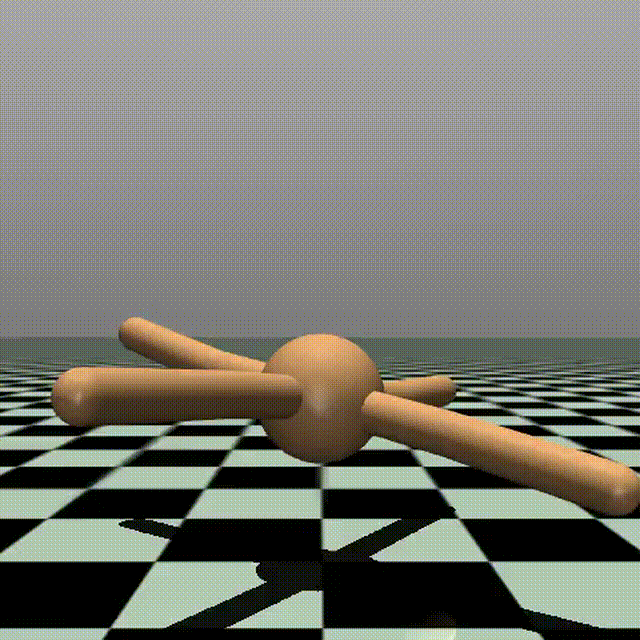

# Recursive Reward Aggregation

Yuting Tang, Yivan Zhang, Johannes Ackermann, Yu-Jie Zhang, Soichiro Nishimori, Masashi Sugiyama  
Reinforcement Learning Conference 2025  
[[OpenReview]](https://openreview.net/forum?id=13lUcKpWy8)

## Docker

You can build and run the Docker container as follows.

### Step 1: Build the Docker image

```sh
cd docker
docker build -t rra_image . -f Dockerfile 
```

### Step 2: Run the Docker container

```sh
docker run -dit -p 8888:22 --mount type=bind,source=/path/to/your/RRA,destination=/workspace/RRA --name rra_container -m 16g --gpus all rra_image /bin/bash
```

Replace `/path/to/your/RRA` with the absolute path to your local RRA directory.

### Step 3: Enter the running container

Once the container is up and running, you can access its shell with:

```sh
docker exec -it rra_container bash
```

### Additional Setup for Experiments

To run Continuous Control and Portfolio experiments inside the Docker container, you will also need to manually install:

```sh
pip install torch stable-baselines3 empyrical tensorboard distrax IPython
```

Make sure to run this inside the container after building it.

### Tips

If you encounter issues with **Cython**, try the following:

```sh
pip uninstall Cython
pip install Cython==3.0.0a10
```

This can resolve version conflicts or compatibility issues with certain dependencies.

## Experiments

### 1. Grid-World Environment

See this [notebook](grid/grid.ipynb).

### 2. Wind-World Environment

See this [notebook](wind/wind.ipynb).

### 3. Continuous Control Experiment

Partially built upon Stable-Baselines3.

You can run the continuous control experiments using the provided shell script.

```sh
cd continuous_control
bash run_td3.sh [SEED] [ENV] [RECURSIVE_TYPE]
```

- `SEED` (optional): Random seed for training. Default: `42`.
- `ENV` (optional): OpenAI Gym environment name. Default: `Ant-v3`. Available options: `Ant-v3`, `Walker2d-v3`, `Hopper-v3`.
- `RECURSIVE_TYPE` (optional): Type of recursive aggregation to use in training. Default: `dsum`. Available options: `dsum`, `dmax`, `min`, `dsum_dmax`, `dsum_variance`.

If no arguments are provided, the script will use the default values.

### 4. Portfolio Experiment

This script runs the portfolio experiment using pre-defined market environments and settings.

```sh
cd portfolio
./run_portfolio.sh
```

## Videos of Continuous Control Experiments

### Lunar Lander Continuous

| dsum | dmax | min | dsum + dmax | dsum - var |
|------|------|-----|-------------|------------|
|  |  |  |  |  |

### Hopper

| dsum | dmax | min | dsum + dmax | dsum - var |
|------|------|-----|-------------|------------|
|  |  |  |  |  |

### Ant

| dsum | dmax | min | dsum + dmax | dsum - var |
|------|------|-----|-------------|------------|
|  |  |  |  |  |
